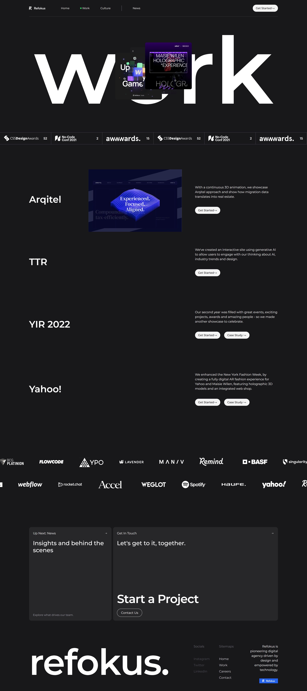

# Refokus Clone Website Project ✨

This repository contains the source code for a React-based replica of the Refokus website. The goal is to recreate the original layout, design, and functionality while adding new features and improvements to enhance the user experience.

## Key Features

-   **Component-Based Architecture:** Built with React JS, the project modularizes the website into individual components that replicate the original structure.
-   **Smooth Animations:** Enhanced scrolling animations using Locomotive, with additional effects applied to sections like work, project box, marquee, and cards for a more engaging visual experience.
-   **Interactive Elements:** Includes custom on-scroll animations in the work section to dynamically load images based on scroll position, and on-hover video playback in the project box.

## Technologies Used

-   **React JS:** For building components and managing state efficiently.
-   **Locomotive:** For implementing smooth, fluid scrolling animations.
-   **Framer Motion:** Used to create visually appealing marquee effects.
-   **Tailwind CSS:** Ensures responsive and consistent styling, matching the design of the original site.
-   **Vercel:** Deployment platform for hosting the live demo.

## Enhancements Over the Original

-   **Improved Scrolling Experience:** Fixed the laggy scrolling issues present on the original site by implementing smooth scrolling.
-   **Performance Boost:** Optimized for better performance, offering smoother transitions and faster page load times.
-   **Increased Interactivity:** Added hover-based animations to the cards section, boosting user engagement.

-   

## Contributions

Contributions are always welcome! If you'd like to contribute, feel free to submit issues or pull requests to improve the project further.

